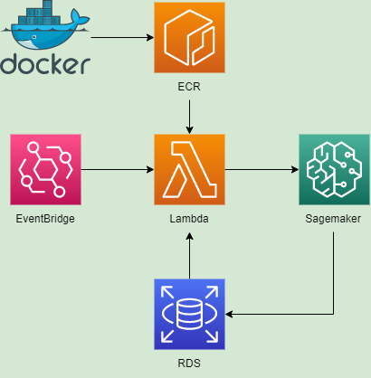

# Monotony Tracker

## Model Architecture


## Setup

### 1. Ensure Docker is installed in system. 
- For Windows, ensure WSL 2 Backend is set up. Windows 11 is required. https://docs.docker.com/desktop/windows/wsl/

### 2. Ensure boto3 library is installed in environment.
```
pip install boto3
```

### 3. Set CLI variables in Jupyter notebook
- if using VSCode, ensure AWS Toolkit extension is installed
- Set up credentials and profile https://docs.aws.amazon.com/toolkit-for-vscode/latest/userguide/setup-credentials.html
```
account_id = boto3.client('sts').get_caller_identity().get('Account')
region = boto3.Session().region_name
ecr_repo = 'monotone-inference'
processing_repo_uri = f'{account_id}.dkr.ecr.{region}.amazonaws.com/{ecr_repo}:latest'
```

### 4. Create docker folder
```
parent directory
│
└─ docker
    │   algorithm.py
    │   Dockerfile
    └─  requirements.txt
```

### 5. Create Dockerfile
- Base docker image utilizing TensorRT image version 21.03 that has minimal requirements to run GPU-acceleration on AWS https://docs.nvidia.com/deeplearning/frameworks/support-matrix/index.html
- NVIDIA driver has to be downgraded within the docker image due to AWS requirements, this is due to TensorRT 21.03 coming with NVIDIA CUDA 11.2.1 that requires NVIDIA driver versions R450 (450.51) or earlier for Data Centre GPUs like NVIDIA T4
- For libraries such as Librosa, special Ubuntu drivers have to be installed such as libsndfile1 and libpq-dev
```
FROM nvcr.io/nvidia/tensorrt:21.03-py3

RUN apt-get update && apt install -y \
    nvidia-utils-450 \
    ubuntu-drivers-common

RUN apt update && \
    apt-get install -y \
    libsndfile1 \ 
    libpq-dev gcc

COPY requirements.txt requirements.txt

RUN pip3 install -r requirements.txt

LABEL maintainer="Xaltius"

ENV PYTHONUNBUFFERED=TRUE

ENV TOKENIZERS_PARALLELISM=false

RUN mkdir -p /opt/ml/processing/inputs
RUN mkdir -p /opt/ml/processing/models
RUN mkdir -p /opt/ml/processing/logs
RUN mkdir -p /opt/ml/processing/snippets

COPY . /usr/src/app
```

### 6. Create requirements.txt
- numpy version has to be specified first as Tensorflow will attempt to install numpy >= 1.20 which is incompatible to many libraries in Python.
```
numpy==1.19.5
tensorflow
soundfile
librosa
boto3
psycopg2-binary
```

### 7. Write CLI commands
```
# Creates docker image from Dockerfile
!docker build --no-cache -t $processing_repo_uri docker

# Login into AWS via AWS CLI
!aws ecr get-login-password --region {region} | docker login --username AWS --password-stdin {account_id}.dkr.ecr.{region}.amazonaws.com

# Creates ECR repository if it does not exist
!aws ecr create-repository --repository-name $ecr_repo

# Pushes the created docker image to ECR repository
!docker push $processing_repo_uri

# Deletes created docker image from system memory
!docker image rm $processing_repo_uri
```

### 8. Write execution script in Lambda
- Use boto3 functions to deploy Sagemaker Processing Jobs
- Utilize `g4dn.xlarge` instance type made up of T4 GPUs for most optimal performance and pricing https://aws.amazon.com/ec2/instance-types/
- Insert important variables like keys and passwords into test inputs and call as dictionary for safety
- ProcessingJobs accepts multiple inputs and outputs, just add into the ProcessingInput function
- An Output has to be specified, can simply output an empty json/csv into an S3 Bucket if no output is required
```
import boto3
import time

def ProcessingInput(input_name, source, destination):
    return {
        'InputName': input_name,
        'S3Input': {
            'S3Uri': source,
            'LocalPath': destination,
            'S3DataType': 'S3Prefix',
            'S3InputMode': 'File'}
    }

def ProcessingOutput(output_name, source, destination):
    return {
        "OutputName": output_name,
        "S3Output": {
            "S3Uri": destination,
            "LocalPath": source,
            "S3UploadMode": "EndOfJob"
        }
    }
    
def lambda_handler(event, context):
    
    timestamp = time.strftime('%Y%m%d-%H%M%Shrs')
    local_dir = "/opt/ml/processing"
    
    # Inputs
    models = ProcessingInput(
        input_name="models",
        source=f"s3://{event['bucket_name']}/models/segmentor.h5",
        destination=f"{local_dir}/models/")
    
    # Outputs
    snippets = ProcessingOutput(
        output_name="snippets",
        source=f"{local_dir}/snippets/",
        destination=f"s3://{event['bucket_name']}/{event['bucket_key']}/"
    )

    outputs = {"Outputs": [snippets]}
        
    processing_resource = {
        'ClusterConfig': {
            'InstanceCount': 1,
            'InstanceType': 'ml.g4dn.xlarge',
            'VolumeSizeInGB': 30}
    }
    
    app_specification = {
        'ImageUri': '183640780274.dkr.ecr.ap-southeast-1.amazonaws.com/monotone-inference:latest',
        'ContainerEntrypoint': [
            "python3", 
            "/usr/src/app/algorithm.py"],
        'ContainerArguments': [
            f"--access_id={event['access_id']}", 
            f"--access_key={event['access_key']}",
            f"--bucket_name={event['bucket_name']}",
            f"--bucket_key={event['bucket_key']}",
            f"--host={event['host']}",
            f"--port={event['port']}",
            f"--user={event['user']}",
            f"--password={event['password']}",
            f"--dbname={event['dbname']}",
            "--verbose=1",]
    }
    
    sagemaker_client = boto3.client('sagemaker')
    processing_response = sagemaker_client.create_processing_job(
        ProcessingInputs=[models],
        ProcessingOutputConfig=outputs,
        ProcessingJobName=f'monotone-inference-{timestamp}',
        ProcessingResources=processing_resource,
        StoppingCondition={'MaxRuntimeInSeconds': 600},
        AppSpecification=app_specification,
        RoleArn=event['role_arn'])
    return processing_response
```